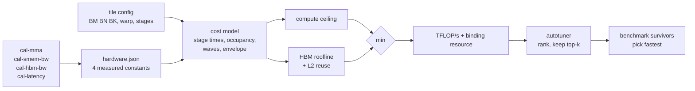

# ridge

ridge predicts how fast a tensor-core GEMM will run on an A100 before you compile or run it. Hand it a tile configuration and it returns sustained throughput along with the hardware resource that limits it: tensor-core issue, shared-memory bandwidth, HBM, occupancy, or an underfilled grid.

I wanted to know whether a model built that way is accurate enough to be worth having. It lands at 16% mean error, which is too loose to trust as a throughput estimate but good enough to cut an autotuning search by 2.4x with no measurable loss.

## Architecture



## The four pieces

### Model

A multi-stage roofline, closed form, O(1) per config. Per K-step it computes tensor time from the calibrated MMA issue cost and shared-memory time from the `ldmatrix` byte traffic. Those two add rather than overlap, which is the one place the ISA forces a dependency: `cp.async` is asynchronous by construction so global traffic really does hide under compute, but `ldmatrix` is synchronous and the next `mma` consumes the registers it just wrote. Modelling that as a `max` gives 36% MAPE and as a sum gives 30%, everything else held fixed.

On top of that sit three deratings: occupancy against the shared-memory, register and warp limits, wave quantization for grids that do not divide evenly across 108 SMs, and a prologue/epilogue envelope for the pipeline fill and accumulator drain. The prediction is the smaller of a compute ceiling and an HBM roofline, and whichever term is furthest from 1.0 becomes the reported bottleneck.

### Calibrate

Four CUDA microbenchmarks measure the constants on the card being used, rather than reading them off a datasheet. The datasheet figures are kept only as sanity bands to catch a broken benchmark.

| Constant | Measured | Datasheet | |
|---|---|---|---|
| `mmaCyclesPerInst` | 2.026 cycles | implies 307.9 vs 312 TFLOP/s | 98.7% |
| `smemBytesPerCycle` | 127.88 B/cycle/SM | 128 theoretical (32 banks x 4 B) | 99.9% |
| `hbmBytesPerSec` | 1.462 TB/s | 1.555 TB/s | 94.0% |
| `warpsNeededToHide` | 4 warps/SM | saturation point, swept across ILP 1-8 | |

The MMA benchmark is the one that is easy to get wrong. Throughput is not latency, so a loop accumulating into the same registers measures the dependency chain and gives a constant several times too large. Each warp keeps eight independent accumulator sets to avoid that.

### Autotune

The model ranks candidate tile configs, the top *k* get benchmarked, and the fastest of those wins. The model prunes, the hardware decides.

This split is the whole design. Ridge's ranking is mean Spearman 0.65 with worst-case regret near 48%, so letting it choose a config outright gives a weak answer. Pruning asks something much easier of it: not "which config is fastest" but "is the fastest config somewhere in your top ten". A mediocre ranker is still a good filter, and the measurement step recovers the exact optimum.

### Validate

A hand-written FP16 tensor-core GEMM is the ground truth the model is checked against. It uses a multi-stage `cp.async` pipeline, `ldmatrix` for register fragments, `mma.sync.m16n8k16` with FP32 accumulate, 16-byte row padding for bank conflicts, and a CTA swizzle for L2 locality. 24 template variants, spill-free, and it reaches 73% of cuBLAS.

## Results

### Autotuning

14 problem shapes x 24 tile configs, held out. Regret is against the exhaustive best, meaning the fastest config actually measured for that shape.

| top k | benchmarks | vs exhaustive | mean regret | worst regret | exact optimum |
|---|---|---|---|---|---|
| 1 | 14 | 24.0x | 8.66% | 33.95% | 1/14 |
| 3 | 42 | 8.0x | 3.19% | 13.89% | 8/14 |
| 5 | 70 | 4.8x | 3.08% | 13.89% | 8/14 |
| **10** | **140** | **2.4x** | **0.00%** | **0.05%** | **13/14** |
| 20 | 280 | 1.2x | 0.00% | 0.00% | 14/14 |

At k=10 the pruned search is effectively lossless. The k=1 row is why this is built as a pruner and not a selector.

### Accuracy

The model was developed against one GPU session and validated on a second, independently recalibrated and re-measured, that it had never been tuned against.

| | development | held out |
|---|---|---|
| MAPE | 16.35% | **16.38%** |
| median absolute error | 11.77% | 11.87% |
| p90 absolute error | 33.54% | 33.50% |
| mean Spearman, per shape | 0.650 | 0.653 |

A 0.03 point gap between the two is the useful number here, since it says the terms generalize rather than memorize. The problem shapes were committed to `data/sweep/phase4-registered.csv` before any measurement existed, so the accuracy figure cannot come from quietly dropping configs the model handles badly.

### Kernel

| | |
|---|---|
| 4096 cubed | 175.0 TFLOP/s, **72.9% of cuBLAS** |
| best measured | 181.0 TFLOP/s |
| K=128 | **106.2% of cuBLAS** |
| register spills | none, all 24 variants |

The K=128 result is the interesting one. cuBLAS is tuned for large K, and a correctly chosen tile beats it when there is little K to amortize over.

## How it compares

### Against a full search, and against rules of thumb

| Comparison | Result | Why it matters |
|---|---|---|
| Exhaustive autotuning | Same config on 13/14 shapes, 2.4x fewer benchmarks | The model never has to be right about magnitude, only about keeping the winner in a shortlist. |
| Occupancy and roofline heuristics | Those score 9.1% and 10.9% regret at k=8, against 3.6% for random | Standard heuristics are not noisy here, they are biased toward large tiles that lose to wave quantization, so they underperform a uniform sample. |
| Nsight Compute bottleneck labels | 8/8 on `SMEM` and `WAVES` | Achieved warps also matched theoretical warps on all 12 profiled configs, which independently confirms the occupancy math. |

### Against published models

Ridge is a calibrated roofline. TileSight builds a producer-consumer DAG and searches legal orderings, which is a different class of model, and the gap shows.

| Comparison | Result | Where the gap comes from | How to close it |
|---|---|---|---|
| TileSight (single-GPU GEMM MAPE) | 12.35% vs 16.38% | Their 12.35% is pooled across A100, H200, B200 and B6000, a much wider scope than one card and one dtype. Ridge is behind on an easier problem. | Model the dependency graph rather than hard-coding one edge. |
| tritonBLAS (analytical selection) | 94.7% of exhaustive vs 91.3% | Their selection is purely analytical with no benchmarking. Ridge's 91.3% is its top-1 pick, and the lossless number needs 10 measured runs. | Improve ranking, not magnitude. Four problem shapes still rank negatively. |
| Ridge's own worst configs | 38.93% MAPE on 42 of 336 configs | All at exactly 4 active warps per SM, where the occupancy term saturates to 1.0. Excluding them MAPE is 13.16%. | Unknown. The obvious explanation was that the latency benchmark measured saturation at higher ILP than the kernel carries, but sweeping ILP 1 through 8 puts it at 4 warps every time, so the hypothesis is refuted and the cause is open. |

That last row is the honest state of the model. The error is concentrated in one config class with a known trigger and no known mechanism.

## Benchmarks

```bash
# One command on a fresh GPU box: check MIG, lock clocks, build, calibrate
./setup-box.sh

# Kernel correctness against a float64 reference, then throughput vs cuBLAS
./build/check-gemm

# The measurement sweep, 336 configs, 4-8 min, use tmux
./build/measure

# Model accuracy and per-shape ranking against the sweep
python3 bench/validate.py

# Autotuner: shortlist size vs regret. Runs offline, no GPU needed
python3 tools/ridge-autotune.py

# Bottleneck labels vs Nsight Compute, 12 pre-registered configs
bash bench/run-ncu-validation.sh

# Ridge as a pruner for Triton's own GEMM autotuner
python3 bench/triton-compare.py
```

## Getting started

The model itself needs no GPU. Everything builds in Docker.

```bash
docker compose build                                    # one-time
docker compose run --rm dev bash -c "cmake -S . -B build -DCMAKE_BUILD_TYPE=Release && cmake --build build -j"

docker compose run --rm dev ./build/ridge-predict \
    --gpu a100 --m 4096 --n 4096 --k 4096 \
    --bm 128 --bn 128 --bk 32 --warpm 64 --warpn 64 --stages 3
```

```
predicted:       120.2 TFLOP/s   bottleneck: SMEM
peak tensor:     311.9   compute ceiling:    120.2   HBM ceiling:   2304.0
smem eff: 0.67   occ factor: 0.75   arith intensity: 1152.0 FLOP/byte
grid: 1024 CTAs in 324 slots   waves: 3.16   wave eff: 0.790
step: 768 cyc = 512 mma + 256 ldmatrix, in series
envelope eff: 0.975   128 K-steps   prologue 832 cyc   epilogue 1663 cyc
```

Pass `--hw data/hardware/a100-sxm4-40gb.json` to use measured constants instead of datasheet placeholders. The tool says which it used.

## Testing

```bash
docker compose run --rm dev ./build/test-model
```

`test-model` pins a worked example value by value, so a math regression that happens to preserve the invariants still fails. The numbers in it are derived by hand rather than pasted from program output, which is the only thing that makes it an independent check rather than a snapshot of whatever the code currently does.

The kernel has its own gate in `check-gemm`, which self-tests first: it feeds the comparison deliberately corrupted results and asserts every one is rejected. A correctness check that cannot fail says nothing when it passes, and this one caught two real bugs, a phantom prologue tile when K is shorter than the pipeline depth and an epilogue racing in-flight `cp.async`.

## Scope

One GPU (A100), one dtype (FP16), dense GEMM. The model's terms are derived for the kernel structure in `bench/kernels/`, so applying it to a kernel with a different overlap pattern is out of scope rather than merely inaccurate. It also has no term for the CTA swizzle, so it predicts identically across every swizzle group.

## Next steps

In the order I would do them.

**1. Find the 4-active-warp mechanism.** This is worth about 3 points of MAPE and it is the only error large enough to matter. 42 of 336 configs over-predict by 39%, all at exactly 4 active warps per SM, and excluding them the model sits at 13.16%. The ILP explanation is already ruled out by the sweep in `cal-latency`. The next hypothesis is barrier cost: with one resident CTA every `__syncthreads` stalls the whole SM, and with two the other CTA covers it, which fits the sign and roughly the size. Test it with a microbenchmark that varies resident CTAs at fixed warp count before adding any term to the model.

**2. Model the CTA swizzle.** `GemmConfig` has no field for it, so the model predicts identically across all six swizzle groups in the sweep while they measure differently. The L2 reuse term already assumes the resident CTAs form a square region, which is exactly what the swizzle controls, so this is making an existing assumption explicit rather than adding a new mechanism.

**3. Add a dependency graph.** The model hard-codes one edge, `ldmatrix` before `mma`, and combines everything else with a `max` that assumes perfect overlap. I built the per-operation resource vector to test whether that was the gap and it changed nothing: under a `max` across resources the tensor pipe dominates at 519 cycles against 384, 116 and 96, so the prediction comes out identical to the two-stage model. The decomposition only helps with an ordering search on top of it, and that ordering search is the real work. It is also what separates this from published models, and it is a rewrite rather than an addition.

**4. Fused kernels, then H100.** The per-K-step stage time is built from exactly two operations because that is a GEMM's entire inner loop, so a fused bias and activation would be predicted exactly as fast as the unfused version. That is the case where step 3's resource vector finally pays for itself, which is why it comes after. H100 is a recalibration for the constants but a structural change for TMA, warp-group MMA and distributed shared memory.
